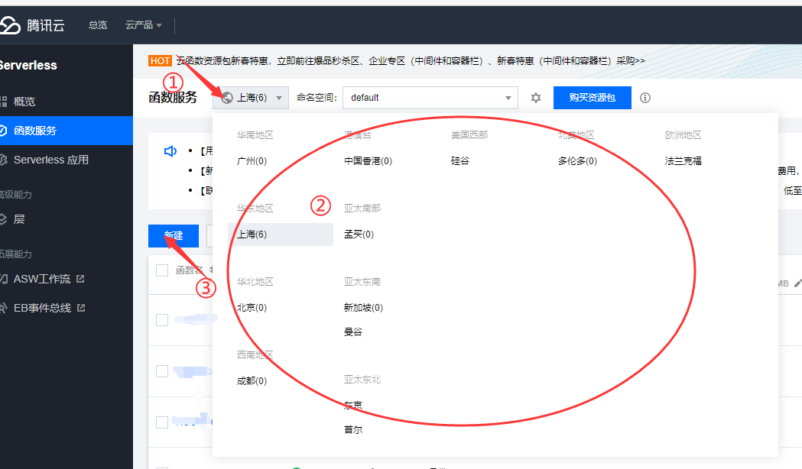
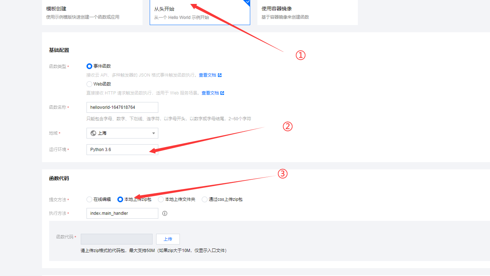
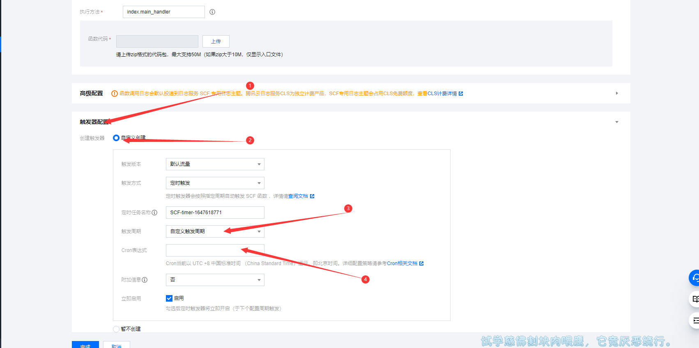
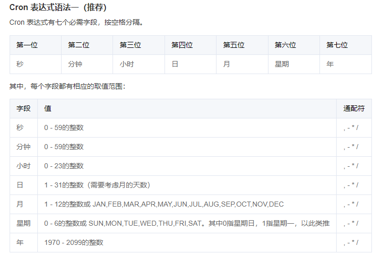
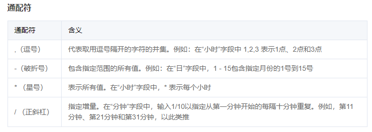
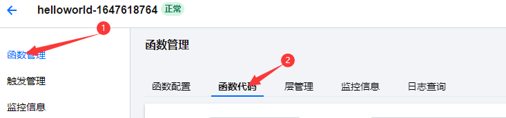
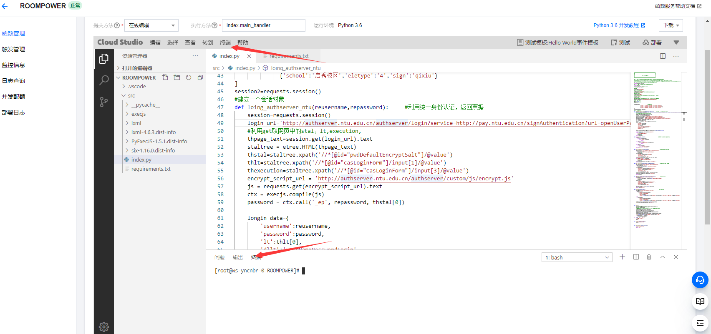
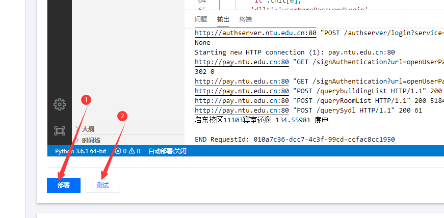

# power by [nkdns](https://nkdns.vinci-studios.com/)

## 声明

本项目为Python学习交流的开源非营利项目，仅作为程序员之间相互学习交流之用。

严禁用于商业用途，禁止使用本项目进行任何盈利活动。

使用者请遵从相关政策。对一切非法使用所产生的后果，我们概不负责。

本项目对您如有困扰请联系我们删除。

## 公告

* 系统晚上封账，可以尽量避开晚23:20到次日早晨00:10

* 目前不能很好的区分需要验证码或是账号密码错误的情况，如遇到验证码，需要手动进行一次统一身份认证登录

* 该项目仅仅是一个登录加解决一个小问题的 Demo 后期优化完全看心情

## 云函数部署教程

### 腾讯云

#### 第一步

登录腾讯云，进入腾讯云函数https://console.cloud.tencent.com/scf/list 没有的先注册，过程免费，可能实名认证要个1元还是0.01元来着忘记了

#### 第二步

选择一个**内陆节点**，并点击**新建**



#### 第三步

选择**从头开始**，选择**python3.6**，**选择本地上传zip包**



#### 第四步

打开**触发器配置**，选择**自定义创建**，将触发周期改成**自定义触发周期**，在**Cron表达式**那里填写你希望程序自动执行的时间。



##### 关于Cron表达式的介绍

这里介绍官方推荐的Cron 表达式语法一

一共有7位(含义如下):
    第一位：秒 (有效参数：0 - 59 的整数)

    第二位：分钟 (有效参数：0 - 59 的整数)

    第三位：小时 (有效参数：0 - 23 的整数)

    第四位：日 (有效参数：1 - 31 的整数，需要考虑当月一共有几天)

    第五位：月 (有效参数：1 - 12 的整数 或 JAN,FEB,MAR,APR,MAY,JUN,JUL,AUG,SEP,OCT,NOV,DEC)

    第六位：星期 (有效参数：0 - 6 的整数 或 SUN,MON,TUE,WED,THU,FRI,SAT。其中0指星期日，1指星期一，以此类推)

    第七位：年 (有效参数：1970 - 2099 的整数)



通配符含义:
    腾讯云在这支持Cron的(, - * /)4种通配符

    ","（逗号 半角）：代表取用逗号隔开的字符的并集。例如：在“小时”字段中 1,2,3 表示1点、2点和3点

    "-"(减号)：包含指定范围的所有值。例如：在“日”字段中，1 - 15包含指定月份的1号到15号

    "*"(星号)：表示所有值。在“小时”字段中,用 星号 表示每个小时

    "/"(正斜杠)：指定增量。在“分钟”字段中，输入1/10以指定从第一分钟开始的每隔十分钟重复。例如，第11分钟、第21分钟和第31分钟，以此类推



更多请参考官方文档：[定时触发器说明](https://cloud.tencent.com/document/product/583/9708#cron-.E8.A1.A8.E8.BE.BE.E5.BC.8F/)

#### 第五步

点击完成后在**函数管理**中点击**函数代码**完善个人配置



#### 第六步

安装需要的库文件，打开**终端**



在终端中**输入**```pip3 install -r ./src/requirements.txt -t ./src/ -i https://mirrors.aliyun.com/pypi/simple```

##### 终端代码的含义

该含义是利用pip3 将 src文件夹下requirements.txt文件中所列出的库(含库版本)安装到src目录中，安装源选择https://mirrors.aliyun.com/pypi/simple/（阿里云镜像服务器）

在腾讯云中不是所有的库都是需要安装的，在云python3.6中腾讯云已经内置了一些库，可以直接调用

腾讯云提供的库(https://cloud.tencent.com/document/product/583/55592/)：
    库名称	版本
    absl-py	0.2.2
    asn1crypto	0.24.0
    astor	0.7.1
    bleach	1.5.0
    certifi	2019.3.9
    cffi	1.12.2
    chardet	3.0.4
    cos-python-sdk-v5	1.6.6
    cryptography	2.6.1
    dicttoxml	1.7.4
    gast	0.2.0
    grpcio	1.13.0
    html5lib	0.9999999
    idna	2.8
    iniparse	0.4
    Markdown	2.6.11
    mysqlclient	1.3.13
    numpy	1.15.0
    Pillow	6.0.0
    pip	9.0.1
    protobuf	3.6.0
    psycopg2-binary	2.8.2
    pycparser	2.19
    pycurl	7.43.0
    PyMySQL	0.9.3
    pytz	2019.1
    qcloud-image	1.0.0
    qcloudsms-py	0.1.3
    requests	2.21.0
    serverless-db-sdk	0.0.1
    setuptools	28.8.0
    six	1.12.0
    tencentcloud-sdk-python	3.0.65
    tencentserverless	0.1.4
    tensorboard	1.9.0
    tensorflow	1.9.0
    tensorflow-serving-api	1.9.0
    termcolor	1.1.0
    urllib3	1.24.2
    Werkzeug	0.14.1
    wheel	0.31.1


#### 第七步

点击**部署**将刚刚的修改同步到服务器保存。

点击**测试**查看程序是否成功执行

